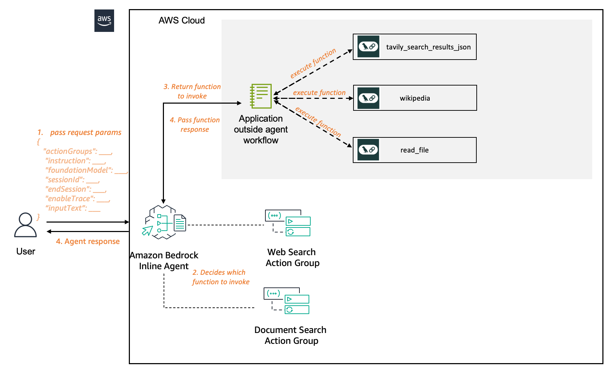

# Utilize LangChain Tools with Amazon Bedrock Inline Agents

In this code example we will orchestrate a workflow that utilizes LangChain tools like [TavilySearchResults](https://python.langchain.com/docs/integrations/tools/tavily_search/), [WikipediaQueryRun](https://api.python.langchain.com/en/latest/tools/langchain_community.tools.wikipedia.tool.WikipediaQueryRun.html), and [FileManagementToolkit](https://python.langchain.com/docs/integrations/tools/filesystem/), along with Amazon Bedrock Inline Agents. 

For a full list of LangChain tools refer to the guide [here](https://python.langchain.com/docs/integrations/tools/).

## Architecture



## Steps to orchestrate workflow

### Step - 1: Setup Langchail tools

```python

from langchain_community.tools.tavily_search import TavilySearchResults
from langchain_community.tools import WikipediaQueryRun
from langchain_community.utilities import WikipediaAPIWrapper
from langchain_community.agent_toolkits import FileManagementToolkit


from utility import process_trace, invoke_inline_agent_helper, create_parameters, invoke_agent_with_roc

# Pass the TAVILY API KEY, get started at https://tavily.com/.
os.environ["TAVILY_API_KEY"] = "XXXXXXX"

tavily_search = TavilySearchResults()

wikipedia_query_runner = WikipediaQueryRun(api_wrapper=WikipediaAPIWrapper(top_k_results=1, doc_content_chars_max=100))

file_management_toolkit = FileManagementToolkit(
    root_dir=str("dataset"),
    selected_tools=["read_file"],
)  # If you don't provide a root_dir, operations will default to the current working directory

read_file_tool = file_management_toolkit.get_tools()[0]

tool_list = {tavily_search.get_name(): tavily_search, wikipedia_query_runner.get_name(): wikipedia_query_runner, read_file_tool.get_name(): read_file_tool}
```

### Step - 2: Define actionGroups
```python
actionGroups = [
    {
        'actionGroupExecutor': {
            'customControl': 'RETURN_CONTROL', # configure return control
        },
        'actionGroupName': 'WebSearchActionGroup',
        'functionSchema': {
            'functions': [
                {
                    'description': tavily_search.description,
                    'name': tavily_search.get_name(),
                    'parameters': create_parameters(tavily_search),
                    'requireConfirmation': 'DISABLED'
                },
                {
                    'description': wikipedia_query_runner.description,
                    'name': wikipedia_query_runner.get_name(),
                    'parameters': create_parameters(wikipedia_query_runner),
                    'requireConfirmation': 'DISABLED'
                },
            ]
        },
    },
    {
        'actionGroupExecutor': {
            'customControl': 'RETURN_CONTROL', # configure return control
        },
        'actionGroupName': 'DocumentSearchActionGroup',
        'functionSchema': {
            'functions': [
                {
                    'description': "Search Amazon's 2022 Shareholder letter",
                    'name': read_file_tool.get_name(),
                    'requireConfirmation': 'DISABLED'
                },
            ]
        },
    },
]
```

### Step - 3: Invoke Agent and process return of control

```python
# change model id as needed
model_id = "anthropic.claude-3-sonnet-20240229-v1:0"

# customize instructions of inline agent
agent_instruction = """You are a helpful AI assistant that provides users with latest updates in Generative Ai."""

invoke_agent_with_roc(actionGroups, agent_instruction, model_id, "Tell me top 5 latest products in Generative Ai.", tool_list)

```